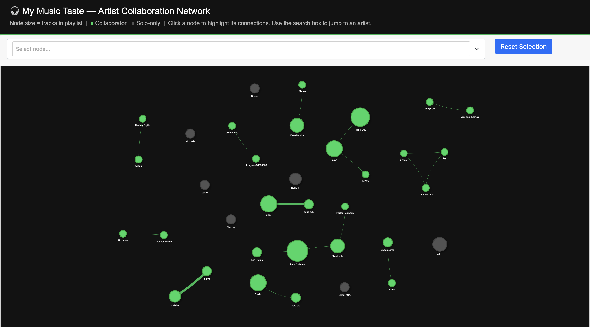

# Personal Music Taste Analysis

A data analysis project exploring patterns in my own Spotify listening habits — which artists I gravitate toward, how often I listen to collaborations vs. solo tracks, stylistic patterns in track titles, and how my favorite artists connect to each other through collaborations.

## Overview

I pulled the tracklist from one of my personal Spotify playlists (105 tracks, 74 unique artists) and analyzed it using Python, SQL, and basic statistics, then built an interactive network graph to visualize artist collaborations.

Questions explored:
- Which artists dominate my listening?
- Do I prefer solo tracks or collaborations?
- How concentrated is my listening across artists?
- How do my favorite artists connect to each other through features/collabs?

## Interactive Visualization

`build_network.py` generates an interactive artist collaboration network using **PyVis** — each node is an artist (sized by track count), and edges represent collaborations between artists in the playlist. Open `artist_network.html` in a browser to explore it: drag nodes, zoom, and hover for details.


*(Screenshot preview — open `artist_network.html` locally for the full interactive version)*

## Tech Stack

- **Python** (pandas) — data cleaning and structuring
- **SQLite / SQL** — loading data into a local database and querying it directly (GROUP BY, aggregate functions, subqueries)
- **SciPy** — statistical analysis and hypothesis testing
- **PyVis / NetworkX** — interactive network graph visualization

## Key Findings

- **74 unique artists** across 105 tracks, with **Frost Children (7 tracks)**, **Tiffany Day (6)**, and **slayr / aidn. / 2hollis (5 each)** as top repeat artists
- **83.8% of tracks are solo artist tracks vs. 16.2% collaborations** — a chi-square goodness-of-fit test found a statistically significant difference from a 50/50 expected split (p < 0.0001). This shows the split is unlikely to have occurred under a 50/50 null hypothesis; it does not by itself prove a "genuine preference," since factors like how the playlist was built could also explain the skew.
- **Skewness of 2.32** in the tracks-per-artist distribution — a small number of artists account for a disproportionate share of the playlist (51 of 74 artists appear only once, while a handful appear 5+ times)
- Track titles skew short, most commonly **1-2 words**

## Files

- `my_playlist.csv` — raw playlist data (track name, artist)
- `analyze_playlist.py` — pipeline: cleans data with pandas, loads it into SQLite, runs SQL queries, computes statistics
- `build_network.py` — builds the interactive PyVis artist collaboration network
- `artist_network.html` — generated interactive graph (open in browser)
- `playlist.db` — SQLite database generated by the script

## How to Run

```bash
pip install pandas scipy
python3 analyze_playlist.py

pip install pyvis
python3 build_network.py
```

## Note on Data Source

I originally planned to pull Spotify's audio-feature data (tempo, energy, danceability, valence) via the Spotify Web API, but Spotify deprecated that endpoint for new developer apps in late 2024. I explored joining my playlist against a public Kaggle Spotify dataset instead, but found zero verified matches once I required both track name and artist to align — my playlist consists largely of underground/niche artists not represented in that mainstream dataset. Rather than force a mismatched join, I pivoted the analysis to focus on metadata I could verify directly: artist frequency, collaboration patterns, and title structure, plus an interactive network view of how my favorite artists connect.

## Skills Demonstrated

Python, Pandas, SQL, SQLite, statistical hypothesis testing, data cleaning, exploratory data analysis, network visualization
